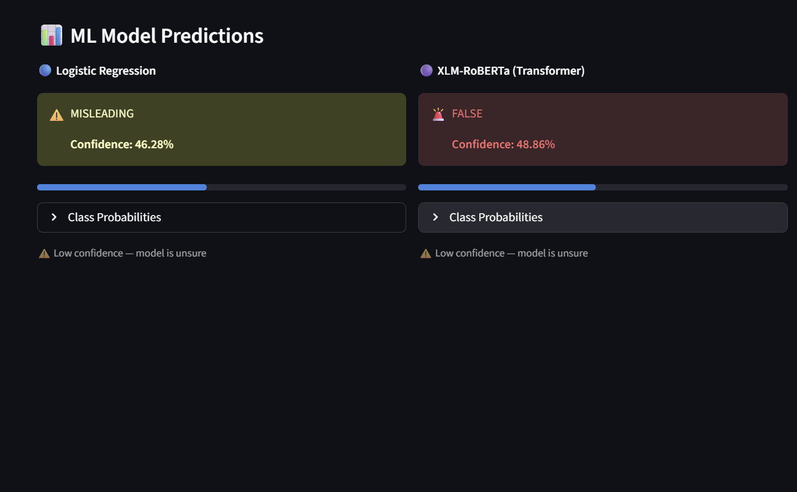
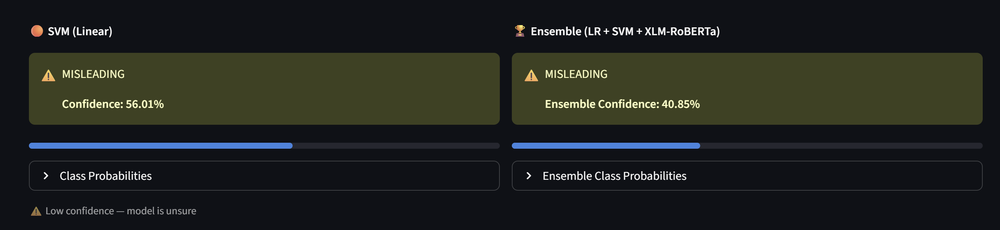
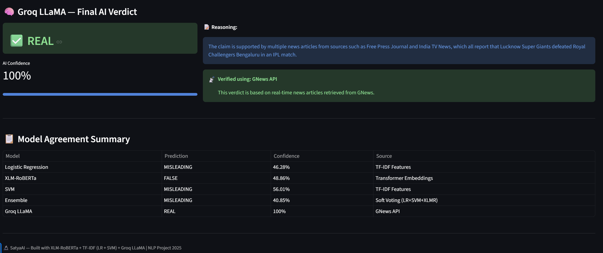

# 📰 SatyaAI — AI-Powered Fake News Detector

<div align="center">


**Cross-Lingual RAG-Based Fact-Checking System**
*Supports English, Hindi, and Hinglish claims*

[🚀 Live Demo](https://satya-ai-fake-news-detector-by-dev-gupta.streamlit.app/) &nbsp;|&nbsp; [📓 Training Notebook](notebooks/) &nbsp;|&nbsp; [📊 Results](#-results)

</div>

---

## 📸 App Screenshots

| Input & ML Predictions | Live News Evidence |
|---|---|
|  |  |

| SVM + Ensemble | Groq LLM Verdict + Summary |
|---|---|
|  |  |

---

## 📌 Overview

**SatyaAI** is an end-to-end multilingual fake news detection system built for Indian language content. It combines traditional machine learning, transformer-based deep learning, real-time news retrieval, and large language model reasoning into a unified fact-checking pipeline.

Given a claim in **English, Hindi, or Hinglish**, the system:
1. Translates it to English using Facebook's **NLLB-200**
2. Runs it through **3 ML models** (Logistic Regression, SVM, XLM-RoBERTa)
3. Fetches **real-time news evidence** from GNews API
4. Gets a **final verdict** from Groq's LLaMA 3.3 70B

---

## 🧠 System Architecture

```
┌─────────────────────────────────────────────────────────────┐
│                    INPUT CLAIM                               │
│            (English / Hindi / Hinglish)                      │
└────────────────────────┬────────────────────────────────────┘
                         │
                         ▼
              ┌──────────────────────┐
              │  NLLB-200 Translation│  (Hindi/Hinglish → English)
              └──────────┬───────────┘
                         │
            ┌────────────┼────────────┐
            ▼            ▼            ▼
     ┌────────────┐ ┌─────────┐ ┌───────────────────┐
     │   TF-IDF   │ │  TF-IDF │ │   XLM-RoBERTa     │
     │ Logistic   │ │   SVM   │ │  (Transformer)    │
     │ Regression │ │         │ │  CLS Embeddings   │
     └──────┬─────┘ └────┬────┘ └────────┬──────────┘
            │             │               │
            └──────┬───────┘───────────────┘
                   │
                   ▼
          ┌─────────────────┐
          │  SOFT VOTING    │
          │    ENSEMBLE     │
          └────────┬────────┘
                   │
        ┌──────────┼──────────┐
        ▼                     ▼
┌──────────────┐     ┌─────────────────┐
│  GNews API   │     │  Groq LLaMA 3.3 │
│ (Live News   │────▶│     70B         │
│  Evidence)   │     │  (Final Verdict)│
└──────────────┘     └─────────────────┘
                              │
                              ▼
                   ✅ REAL / 🚨 FAKE / ❓ UNVERIFIABLE
```

---

## 📊 Results

### Model Performance on Test Set

| Model | Accuracy | F1 Score (Weighted) | AUC (Macro) |
|-------|----------|---------------------|-------------|
| Logistic Regression (TF-IDF) | 67.5% | 67.2% | 0.854 |
| SVM — LinearSVC (TF-IDF) | 68.0% | 67.3% | 0.852 |
| **XLM-RoBERTa (Transformer)** | **71.1%** | **71.3%** | **0.877** |
| Ensemble (LR + SVM + XLMR) | 69.5% | 69.4% | 0.891 |

> XLM-RoBERTa achieves the best single-model accuracy (+3.6% over LR baseline).
> Ensemble achieves the highest AUC score of **0.891**.

### Dataset Details

**Total rows: 1,311** | **Columns: `claim`, `label`, `language`, `source`, `url`**

| Label | Count | % |
|-------|-------|---|
| MISLEADING | 569 | 43.4% |
| FALSE | 426 | 32.5% |
| TRUE | 316 | 24.1% |

> Data scraped from 5 Indian fact-checking platforms: AltNews, BoomLive, Factly, India Today, Vishvas News.

---

## 🗂️ Project Structure

```
SatyaAI/
│
├── app.py                      ← Streamlit web application
├── requirements.txt            ← Python dependencies
├── README.md                   ← Project documentation
├── .gitignore                  ← Git ignore rules
├── .env.example                ← API key template
│
├── notebooks/
│   └── Satya_AI.ipynb          ← Full training notebook (Google Colab)
│
├── data/
│   └── raw/
│       └── final.csv           ← Labeled dataset (EN/HI/Hinglish)
│
├── results/                    ← Evaluation charts & metrics
│   ├── confusion_matrix.png
│   ├── top_tfidf_words_per_label.png
│   ├── model_comparison_xlmr.png
│   └── roc_curves.png
│
└── assets/
    └── screenshots/            ← App screenshots
```

---

## 🛠️ Tech Stack

| Component | Technology |
|-----------|-----------|
| **Web App** | Streamlit |
| **Translation** | Facebook NLLB-200-distilled-600M |
| **Features** | TF-IDF (Word + Character N-grams) |
| **ML Models** | Scikit-learn (Logistic Regression, LinearSVC) |
| **Transformer** | XLM-RoBERTa — `cardiffnlp/twitter-xlm-roberta-base` |
| **LLM Verdict** | Groq — LLaMA 3.3 70B Versatile |
| **Live Evidence** | GNews API |
| **Hosting** | Streamlit Community Cloud |

---

## ⚙️ Run Locally

```bash
# 1. Clone the repo
git clone https://github.com/devgupta111/SatyaAI-Fake-News-Detector.git
cd SatyaAI

# 2. Install dependencies
pip install -r requirements.txt

# 3. Add your API keys
cp .env.example .env
# Edit .env with your real keys

# 4. Run the app
streamlit run app.py
```

> **Note:** Trained model `.pkl` files are hosted on Google Drive.  
> Download them and place in a `models/` folder, or train from scratch using the notebook.

---

## 🔑 API Keys Required

| Key | Source | Free Tier |
|-----|--------|-----------|
| `GNEWS_API_KEY` | [gnews.io](https://gnews.io) | 100 req/day |
| `GROQ_API_KEY` | [console.groq.com](https://console.groq.com) | Generous free tier |

---

## 📓 Training Notebook

The full model training pipeline is in [`notebooks/Satya_AI.ipynb`](notebooks/Satya_AI.ipynb):

- Data loading & validation
- Multilingual preprocessing (Hindi/Hinglish/English)
- NLLB-200 translation
- TF-IDF feature engineering + top-word visualization
- Model training: LR, SVM, XLM-RoBERTa
- Soft-voting ensemble
- ROC/AUC curves & confusion matrix

> Designed to run on **Google Colab** with GPU support.

---

## 👤 Author

**Dev Gupta**  
B.Tech CSE — Data Science & AI | BML Munjal University | 2023–2027  

[](https://github.com/devgupta111)
[](https://linkedin.com/in/devgupta111)

---

## 📄 License

MIT License — feel free to use for academic purposes.

